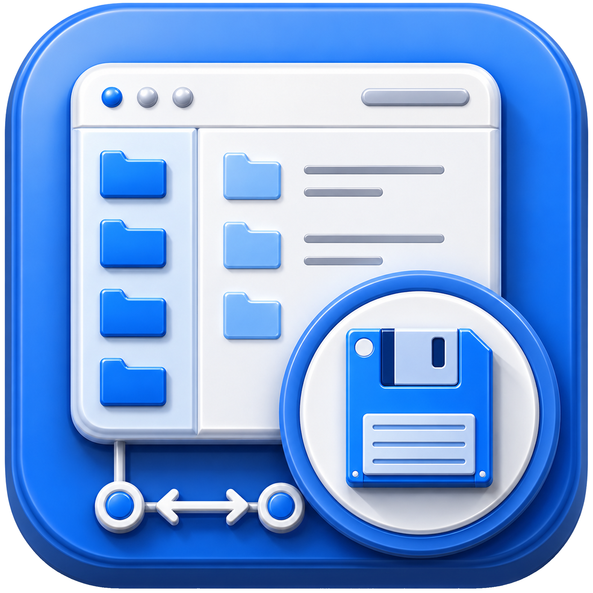

# File Browser Desktop

<p align="center">
  
</p>

<h3 align="center">A dedicated Windows desktop client for privately accessing File Browser over SSH.</h3>

<p align="center">
  <a href="INSTALL.md">Installation</a> |
  <a href="SERVER_SETUP.md">Server setup</a> |
  <a href="SECURITY.md">Security</a> |
  <a href="CHANGELOG.md">Release notes</a> |
  <a href="CONTRIBUTING.md">Contributing</a>
</p>

<p align="center">
  <a href="https://github.com/paravaneai/filebrowser-desktop-windows/releases">
    
  </a>
  <a href="LICENSE">
    
  </a>
  
  
</p>

<p align="center">
  
</p>

## Overview

File Browser Desktop gives File Browser a focused Windows desktop home. It starts a private SSH tunnel, opens File Browser in its own app window, and keeps the browser experience out of your everyday tabs.

The project is built for a simple security model: File Browser stays bound to localhost on your server, and you connect to it through SSH from your Windows desktop.

## Highlights

- Dedicated desktop window for File Browser
- Configurable connection profiles for one or more servers
- SSH tunnel management through the user's installed OpenSSH client
- Support for SSH config, SSH keys, ssh-agent, and optional identity files
- Optional File Browser credential prefill through Windows Credential Manager
- First-run wizard for connecting to an existing server or preparing a new one
- Safe server setup script that keeps File Browser bound to `127.0.0.1`
- Light and dark desktop shell themes
- Clean tunnel shutdown when the app closes

## Install

Download the latest zip from [Releases](https://github.com/paravaneai/filebrowser-desktop-windows/releases), extract it, and run:

```cmd
RunFileBrowserDesktop.cmd
```

Then follow the first-run wizard.

For Windows prerequisites and detailed install steps, see [INSTALL.md](INSTALL.md).

## Connection Model

File Browser Desktop is designed around an SSH-only access path:

```text
Windows desktop app -> SSH tunnel -> server localhost File Browser
```

Recommended server binding:

```text
127.0.0.1:8080
```

Default desktop tunnel:

```text
127.0.0.1:18080 -> server 127.0.0.1:8080
```

Do not expose File Browser directly to the public internet. See [SECURITY.md](SECURITY.md) before using this with a production server.

## Profiles And Credentials

Connection profiles are stored locally at:

```text
%APPDATA%\FileBrowserDesktop\profiles.json
```

Profiles store connection settings such as SSH host, SSH username, SSH port, and tunnel ports. They do not store passwords, passphrases, private keys, or File Browser login credentials.

Optional File Browser credentials are stored in Windows Credential Manager under:

```text
FileBrowserDesktop/FileBrowser/<profile-id>
```

Those credentials are used only to prefill the File Browser login form. The app does not auto-submit login.

## Server Setup

If File Browser is already installed, the wizard can connect to it as long as it is reachable through SSH and bound privately on the server.

If you want help preparing a server, this repo includes:

```text
server/install-filebrowser-localhost.sh
```

The script installs or configures File Browser as a service, binds it to `127.0.0.1`, and does not open public firewall ports. See [SERVER_SETUP.md](SERVER_SETUP.md).

## Documentation

| Document | Purpose |
| --- | --- |
| [INSTALL.md](INSTALL.md) | Windows install steps and prerequisites |
| [SERVER_SETUP.md](SERVER_SETUP.md) | Server install and existing-server setup |
| [SECURITY.md](SECURITY.md) | Security model, credential storage, and cleanup |
| [PACKAGING.md](PACKAGING.md) | Release packaging notes |
| [CHANGELOG.md](CHANGELOG.md) | Version history |
| [SUPPORT.md](SUPPORT.md) | Support expectations |
| [CONTRIBUTING.md](CONTRIBUTING.md) | Development and pull request guidance |

## Current Release

The current public preview release is [v000.001.000](https://github.com/paravaneai/filebrowser-desktop-windows/releases/tag/v000.001.000).

This project is still early. Expect changes around installation, packaging, onboarding, and profile management before the first stable release.

## Contributing

Contributions are welcome. Start with [CONTRIBUTING.md](CONTRIBUTING.md) for development setup, branch guidance, and pull request expectations.

Please also review [CODE_OF_CONDUCT.md](CODE_OF_CONDUCT.md).

## Security

Please do not report sensitive security issues in public issues. See [SECURITY.md](SECURITY.md) for the supported connection model, credential storage details, revocation steps, and reporting guidance.

## Relationship To File Browser

File Browser Desktop is an independent Paravane Labs project. Paravane Labs does not own File Browser and is not affiliated with, endorsed by, or sponsored by the File Browser project.

File Browser is a separate project run by its own maintainers. This desktop app is only a convenience client for connecting to a File Browser instance that you operate.

## License

This project is licensed under the MIT License. See [LICENSE](LICENSE).
