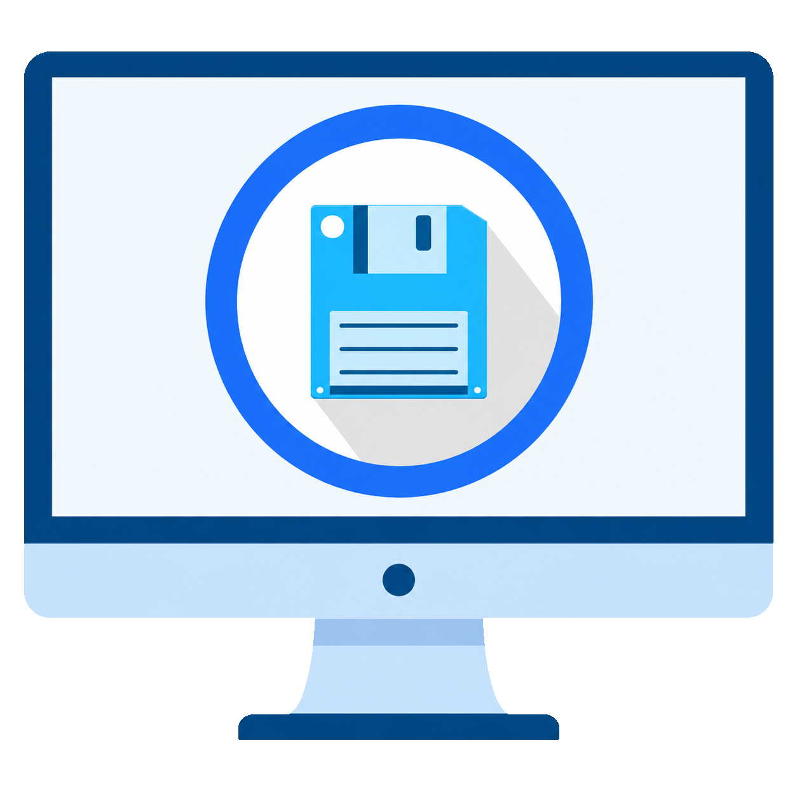

# File Browser Desktop

Small WPF/WebView2 desktop wrapper for the private server-side File Browser.

File Browser Desktop is designed for users who want a dedicated Windows desktop window for File Browser without exposing File Browser directly to the public internet.

<p align="center">
  
</p>

## Project Status

This project is in private preview. Expect early changes around installation, packaging, and onboarding before the first public stable release.

## What It Does

- Lets you create local connection profiles for one or more servers
- Starts an SSH tunnel using the selected profile
- Defaults new profiles to local `127.0.0.1:18080` forwarded to server `127.0.0.1:8080`
- Uses the installed OpenSSH Client (`ssh.exe`) for tunnels
- Supports default SSH config, default keys, ssh-agent, and optional profile-specific identity files
- Stores optional File Browser username/password in Windows Credential Manager
- Opens File Browser inside a dedicated desktop WebView2 window
- Uses `src\Assets\filebrowser.ico` for the app/window/taskbar icon
- Includes a light/dark theme toggle for the desktop shell
- Uses a separate WebView2 profile under `%LOCALAPPDATA%\FileBrowserDesktop\WebView2`
- Stops the SSH tunnel when the desktop window closes

## Profiles

On first run, the app opens a setup wizard with two paths:

- Connect to an existing File Browser instance
- Help install/configure File Browser on a server over SSH

The wizard can:

- Test SSH
- Run the safe server setup script
- Test the tunnel
- Save the profile and open File Browser

Profiles are stored locally at:

```text
%APPDATA%\FileBrowserDesktop\profiles.json
```

The profile file stores SSH host/user/port and tunnel ports only. It does not store File Browser passwords, SSH passwords, passphrases, or private keys.

File Browser credentials are stored per profile in Windows Credential Manager under:

```text
FileBrowserDesktop/FileBrowser/<profile-id>
```

The app uses those credentials only to prefill the File Browser login form. It does not auto-submit the form.

## Server Setup

For a new server, see:

```text
SERVER_SETUP.md
```

The included server script installs/configures File Browser to listen on `127.0.0.1` and does not open firewall ports.

## Install

For Windows prerequisites and zip install steps, see:

```text
INSTALL.md
```

For security expectations and credential revocation steps, see:

```text
SECURITY.md
```

## Packaging

To create a normal zip release:

```cmd
package-release.cmd
```

Details are in:

```text
PACKAGING.md
```

## Dependencies

The framework-dependent zip requires:

- .NET 8 Desktop Runtime
- Microsoft Edge WebView2 Runtime
- OpenSSH Client (`ssh.exe`)

If WebView2 is missing, the app shows the official Microsoft WebView2 install link.

## Security

The supported access model is SSH tunnel only:

```text
Windows desktop app -> SSH tunnel -> server localhost File Browser
```

Do not expose File Browser directly to the public internet. Review `SECURITY.md` before using this app on a production server.

## Contributing

See `CONTRIBUTING.md` for development setup and pull request expectations.

## License

This project is licensed under the MIT License. See `LICENSE`.

## Run

Double-click:

```cmd
RunFileBrowserDesktop.cmd
```

Or run the published executable directly:

```cmd
src\bin\Release\net8.0-windows\win-x64\publish\FileBrowserDesktop.exe
```

## Rebuild

```cmd
dotnet publish src\FileBrowserDesktop.csproj -c Release -r win-x64 --self-contained false
```
